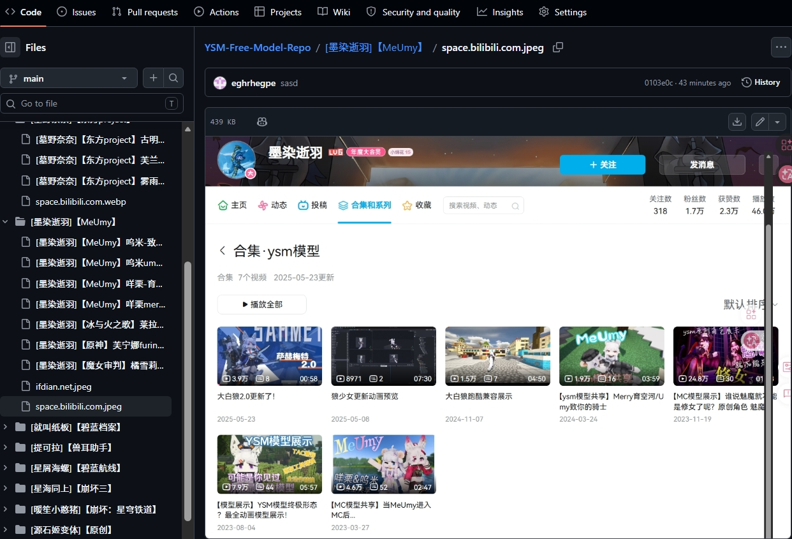

# YSM免费模型汇总

目标：收集中文社区的【免费模型】，并且按[作者名]【角色IP】角色(服饰)2026-5-29的方式命名。

-https://search.bilibili.com/all

-https://ifdian.net/

与 nekohalawrence / FREE-YSM-AUTHOR 做的事情类似。

区别是层级简单一些，玩家更容易找到自己喜欢的模型，

如何下载这些模型？

-点击：↗ 【 <> code 】    ↓ 【dowload zip】 即可

如何安装模型？

-运行：YSM-model-Installer.bat

如何查看拥有的模型、分享您喜欢的模型名称给别人？

-运行bat后，会在 install_report.txt 统计您拥有的所有模型。

国内如何访问GitHub？

-使用《steam ++》/《Watt Toolkit》进行host加速

过程中遇到的难点？

-不知是否要收录【1元模型】、【群限模型】。

-在bilibili搜索【ysm免费分享】时，受到“收费模型、倒卖模型整合包、吐槽YSM收费不合理”等视频的干扰，搜索体验并不好。

-希望作者能标识出【ysm模型分享】、【ysm工坊模型】、【ysm群限模型】、【ysm收费模型】在标题末尾吧。能重命名文件为“[作者名]【角色IP】角色”就更好了。

-↓ 电脑端不能查看B站工坊，买0.01元的模型太折腾人了。↑ 爱发电、进群还好，能立即下载文件。

-少数作者是在多个网盘分发模型，下载起来比较折腾。

-想美化整合包样式，但缺乏相关知识。

-无法在游戏外读取YSM文件的readme.txt。我的收集可能会违反二次配布，更建议你把文件名复制下来，自行搜索。
